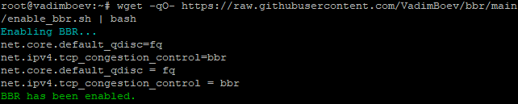

# BBR алгоритм
В этом репозитории два скрипта, enable_bbr.sh и disable_bbr.sh, предназначенные для включения или выключения алгоритма управления перегрузкой BBR в Linux.
  
# Зачем нужен BBR?
Алгоритм BBR (Bottleneck Bandwidth and Round-trip propagation time) обладает несколькими преимуществами по сравнению с традиционными механизмами управления перегрузкой:
- Повышенная пропускная способность: BBR предназначен для максимизации доступной пропускной способности путем точного определения пропускной способности узкого места и времени кругового пути. Это приводит к более высоким скоростям передачи данных по сравнению с другими алгоритмами управления перегрузкой.
- Снижение задержек: За счет минимизации объема данных в пути BBR уменьшает задержки, что особенно выгодно для приложений реального времени, таких как онлайн-игры, видеоконференции и VoIP.
- Снижение потери пакетов: BBR адаптирует скорость отправки данных в зависимости от емкости сети, что помогает снизить потери пакетов и повторные передачи, обеспечивая более стабильное и надежное соединение.
- Эффективное использование ресурсов: BBR оптимизирует использование сетевых ресурсов, динамически изменяя скорость отправки в соответствии с условиями сети, обеспечивая эффективное использование сети без вызывания перегрузок.
  
> [!NOTE]
> Проще говоря, это повлияет на улучшение протокола TCP, тем самым улучшив пропускную способность и ускорив соединение.
  
> [!WARNING]
> Это **НЕ** влияет на пинг!
  
# Как использовать?  
Включить BBR:
```
wget -qO- https://raw.githubusercontent.com/VadimBoev/bbr/main/enable_bbr.sh | bash
```
  
Выключить BBR:
```
wget -qO- https://raw.githubusercontent.com/VadimBoev/bbr/main/disable_bbr.sh | bash
```
  
> [!TIP]  
> При выключении BBR устанавливается CUBIC алгоритм

# Скриншот

  
# BBR algorithm 
This repository contains two scripts, enable_bbr.sh and disable_bbr.sh, designed to enable or disable the BBR congestion control algorithm on Linux systems.  
  
# Why do I need BBR?
The BBR (Bottleneck Bandwidth and Round-trip propagation time) algorithm offers several advantages over traditional congestion control mechanisms:
- Improved Throughput: BBR is designed to maximize the available bandwidth by accurately estimating the bottleneck bandwidth and round-trip time. This leads to higher data transfer rates compared to other congestion control algorithms.
- Lower Latency: By minimizing the amount of data in flight, BBR reduces latency, making it particularly beneficial for real-time applications like online gaming, video conferencing, and VoIP.
- Reduced Packet Loss: BBR adapts its sending rate based on the network's capacity, which helps in reducing packet loss and retransmissions, leading to a more stable and reliable connection.
- Efficient Resource Utilization: BBR optimizes the use of network resources by dynamically adjusting the sending rate according to the network conditions, ensuring that the network is utilized efficiently without causing congestion.
  
> [!NOTE]
> Simply put, it will affect the improvement of the TCP protocol, thereby improving bandwidth and speeding up the connection.
  
> [!WARNING]
> It does **NOT** affect ping!
  
# How to use?  
Enable BBR:
```
wget -qO- https://raw.githubusercontent.com/VadimBoev/bbr/main/enable_bbr.sh | bash
```
Disable BBR:
```
wget -qO- https://raw.githubusercontent.com/VadimBoev/bbr/main/disable_bbr.sh | bash
```
  
> [!TIP]  
> When BBR is turned off, the CUBIC algorithm is set
  
# Screenshot

